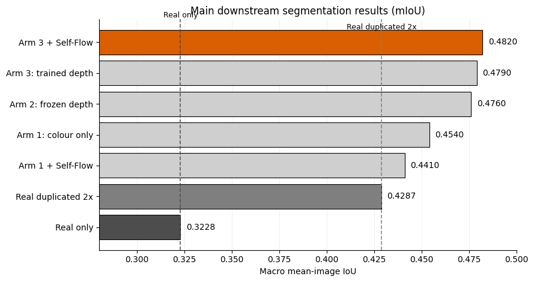
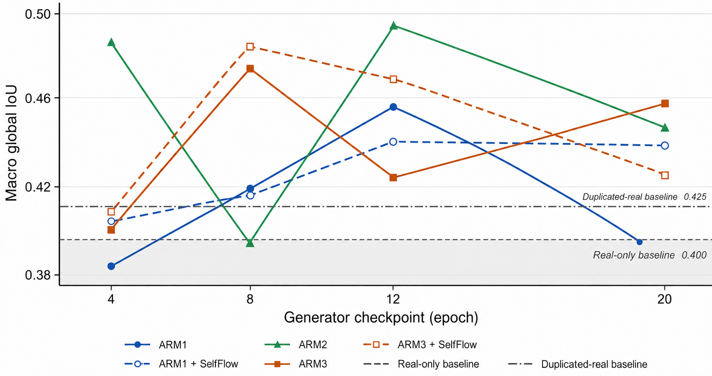

# Synthetic Surgical Images for Downstream Segmentation

Generate laparoscopic images from organ segmentation masks with Stable Diffusion 1.5 +
ControlNet on the DSAD dataset, then measure whether adding those synthetic images to the
real training set improves a downstream SegFormer segmentation model.

The dataset is small — roughly 850 annotated frames — which is the practical problem this
work attacks. A mask-conditioned generator can turn one annotated frame into many plausible
variations, but only if the generator learns enough structure from that same small set. The
research question is therefore whether a **Self-Flow** representation self-distillation loss,
added on top of the usual denoising objective, produces synthetic data that is more useful
downstream than the identical model trained with a plain DDPM loss.

## Pipeline

```
control-net-training/   ->   self-flow-training/   ->   light_downstream/
mask -> image                same generators            real + generated data
generators                   + Self-Flow loss           -> SegFormer -> IoU / Dice
```

Stage 1 trains the mask-conditioned generators. Stage 2 retrains them with the Self-Flow
objective. Stage 3 is the actual measurement: images are sampled from each generator
checkpoint, mixed with the real data, and a SegFormer is fine-tuned and scored on the real
test split. A generator is only "better" if that final number moves.

## Conditioning arms

Three generator configurations are compared, plus a Self-Flow variant of two of them:

| arm | conditioning | script |
|---|---|---|
| Arm 1 | colour map only | `train_controlnet_colormap.py` |
| Arm 2 | colour + **frozen** depth branch | `train_controlnet_depth.py` |
| Arm 3 | colour + **trained** depth branch | `train_controlnet_depth.py --train_depth` |

Depth is kept frozen by default because monocular depth estimators are out of domain on
surgical scenes; it is used as a fixed geometric prior at conditioning scale 0.5, and only
unfrozen in Arm 3 to test whether adapting it helps.

## Self-Flow, and where it is applied

Self-Flow adds a representation loss to the denoising objective:

```
L = L_gen + REP_GAMMA * L_rep
```

`L_gen` is the standard single-timestep DDPM epsilon MSE, kept unchanged so the run never
drifts away from the baseline it is being compared against. `L_rep` is the negative cosine
similarity between mid-block features of a **student**, fed latents where a fraction
`MASK_RATIO` of positions sits at a second independent timestep, and a stop-grad **EMA
teacher**, fed the cleaner homogeneous input at the smaller of the two timesteps. Setting
`REP_GAMMA = 0` disables it entirely and yields the matched plain-DDPM baseline arm, with
data, seed, LR, rank, epochs and augmentation identical — that is what makes the two arms
comparable.

The objective can be attached at two different points, and the repository implements both.

**Approach A — Self-Flow on the ControlNet**, over a warm-started LoRA that stays frozen.
The teacher is an EMA deep copy of the ControlNet; because the LoRA is frozen and shared by
student and teacher, nothing is swapped inside the training loop.

| `self-flow-training/train-cnet-selflfow/` | trains |
|---|---|
| `train_cnet_lorafreez_selfflow.py` | segmentation ControlNet |
| `train_mcnt_lorafreez_selfflow.py` | segmentation + depth ControlNets |

**Approach B — Self-Flow on the UNet LoRA**, with the ControlNet trained plainly on top of
it afterwards. Student and teacher are two PEFT adapters (`default` / `ema`) on the same
UNet, selected with `set_adapter`, so no second copy of the model is needed.

| `self-flow-training/train-lora-selfflow/` | trains | frozen |
|---|---|---|
| `train_lora_selfflow.py` | UNet LoRA, Self-Flow | backbone |
| `train_cnet_seg_frozen_lora.py` | seg ControlNet, plain DDPM | stage-1 LoRA |
| `train_cnet_seg_depth_frozen_lora.py` | seg + depth ControlNet, plain DDPM | stage-1 LoRA |

These five scripts are configured by editing the constants at the top of each file — there
are no CLI flags. Set `WS`, then `DATA`, `OUT` and any warm-start paths; `MAX_TRAIN_SAMPLES
= 2` gives a smoke test. Each run writes `train.log` and per-epoch checkpoints under
`OUT/checkpoints/`, with `final/` as the last one. The EMA teacher and the projection head
are training-only and are not saved.

## Repository layout

| folder | contents | configured by |
|---|---|---|
| `control-net-training/` | Canny baseline, colour-map generator, colour + depth generator | CLI flags |
| `self-flow-training/` | the two Self-Flow approaches, five scripts (above) | constants at the top of each script |
| `light_downstream/` | build real+generated datasets, fine-tune SegFormer-B3, predict, score | CLI flags |
| `util-img/` | result figures used below | — |

The downstream stage runs in four steps: `create_depthtrained_hf_datasets_real_plus_generated.py`
builds a combined HF dataset from the real split plus one generator checkpoint's output,
`train_segformer_light_overlap_ignore_cli.py` fine-tunes SegFormer-B3 on it,
`predict_segformer_overlap_ignore_cli.py` writes label maps for the test split, and
`compute_basic_seg_metrics_ignore255.py` reports per-class IoU, Dice, precision, recall and
specificity.

## Conventions shared across all three stages

- **Text-free.** Every generator trains with an empty prompt, so the model must rely on the
  spatial conditioning rather than on text.
- **8-class colour map.** 0 = background, then abdominal wall, colon, liver, pancreas, small
  intestine, spleen, stomach. Rare organs are painted last so they win overlaps. This
  mapping must stay identical in every script that touches it.
- **Overlaps are ignored.** Where two organ masks overlap, the downstream label is `255` and
  the pixel is excluded from both training and metrics, so ambiguous boundaries never count
  for or against a model.
- **Depth maps** are precomputed as `{idx:06d}.png`, keyed to the dataset row index.

## Requirements

`torch diffusers transformers peft datasets torchvision safetensors numpy pandas pillow evaluate`

CUDA in practice. bf16 plus gradient checkpointing keeps 512×512 at batch 16 inside 24 GB.

## Known gap

`control-net-training/` imports an `exp_utils` module (run directories, logging, checkpoint
pruning) that is not in this repository.

---

# Results

## Main downstream comparison

Macro mean-image IoU on the real test split, after fine-tuning SegFormer on real data plus
generated data from each arm. Two reference points matter: **real only**, and **real
duplicated 2×**, which controls for the fact that adding synthetic data also doubles the
number of training samples. Any arm that beats real-only but not duplicated-real has bought
nothing but repetition.



| configuration | macro mean-image IoU |
|---|---|
| Real only | 0.3228 |
| Real duplicated 2× | 0.4287 |
| Arm 1 + Self-Flow | 0.4410 |
| Arm 1: colour only | 0.4540 |
| Arm 2: frozen depth | 0.4760 |
| Arm 3: trained depth | 0.4790 |
| **Arm 3 + Self-Flow** | **0.4820** |

Every generator arm clears both baselines, so the synthetic images carry real signal rather
than acting as duplication. Depth conditioning is the larger effect, and Self-Flow adds a
further small gain on top of the strongest arm.

## Sensitivity to the generator checkpoint

The same measurement repeated across generator checkpoints (epochs 4, 8, 12, 20), in macro
global IoU. The spread across checkpoints is comparable to the spread across arms, so a
single checkpoint is not enough evidence to rank two generators against each other.



## Self-Flow at the LoRA stage (Approach B)

Reported under both conditioning settings and both averaging schemes, macro-averaged over
the six classes with valid ground truth — a different denominator from the figures above, so
the two are not directly comparable.

```latex
\begin{table*}[t]
\caption{Downstream segmentation from synthetic data generated with the self-supervised
objective applied at the LoRA stage (Approach~B), under both conditioning settings and
both averaging schemes. All values macro-averaged over the six classes with valid ground
truth. Best checkpoint per column in bold.}
\label{tab:sflora}
\centering
\begin{tabular}{ccccccccc}
\toprule
Generator & \multicolumn{4}{c}{Mean-image} & \multicolumn{4}{c}{Global} \\
\cmidrule(lr){2-5}\cmidrule(lr){6-9}
 & \multicolumn{2}{c}{Colour} & \multicolumn{2}{c}{Colour + depth}
 & \multicolumn{2}{c}{Colour} & \multicolumn{2}{c}{Colour + depth} \\
\cmidrule(lr){2-3}\cmidrule(lr){4-5}\cmidrule(lr){6-7}\cmidrule(lr){8-9}
epoch & IoU & Dice & IoU & Dice & IoU & Dice & IoU & Dice \\
\midrule
4  & 0.3744 & 0.4270 & 0.3584 & 0.4029 & 0.3827 & 0.4896 & 0.3828 & 0.4855 \\
8  & 0.3474 & 0.4071 & 0.4006 & 0.4488 & 0.3989 & 0.5154 & 0.3954 & 0.5058 \\
12 & 0.3653 & 0.4129 & 0.3884 & 0.4426 & 0.3931 & 0.4991 & 0.4124 & 0.5297 \\
20 & \textbf{0.4121} & \textbf{0.4605} & \textbf{0.4193} & \textbf{0.4673}
   & \textbf{0.4119} & \textbf{0.5208} & \textbf{0.4198} & \textbf{0.5305} \\
\bottomrule
\end{tabular}
\end{table*}
```

Here the best checkpoint is the last one (epoch 20) in every column, and colour + depth beats
colour alone under both averaging schemes.
