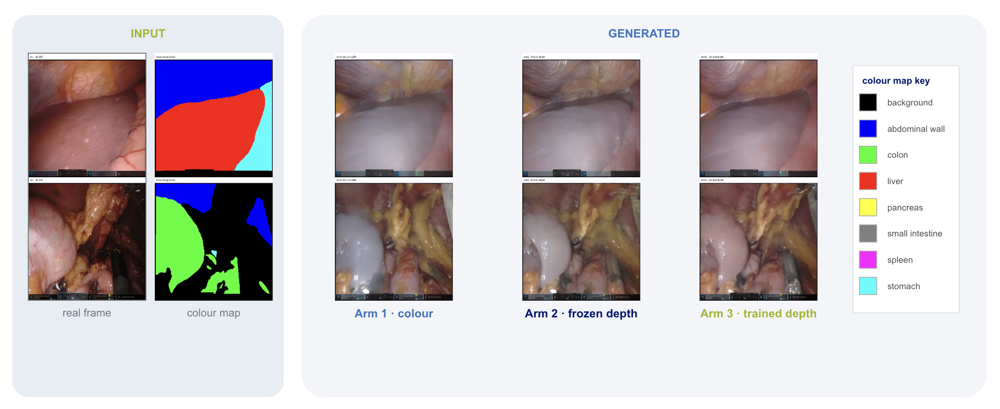
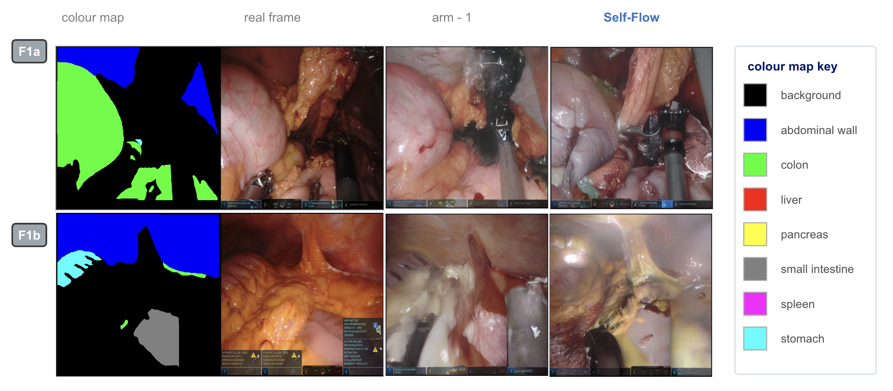
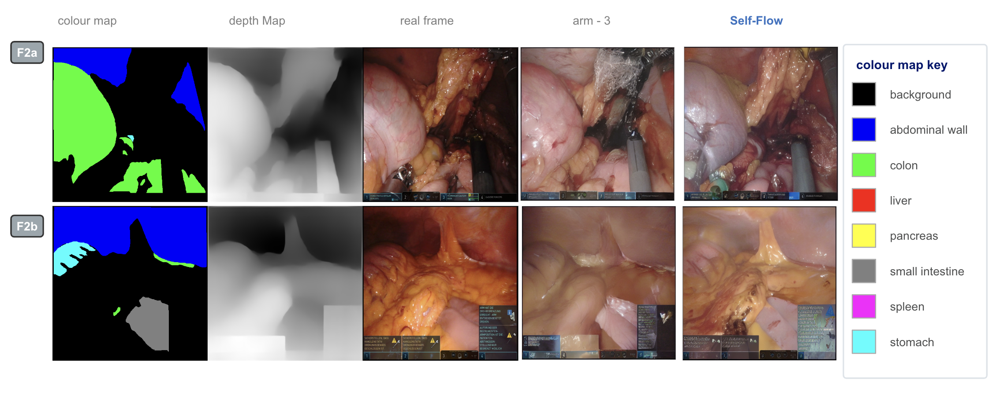

# Synthetic Surgical Images for Downstream Segmentation

Generate laparoscopic images from organ masks with Stable Diffusion 1.5 + ControlNet on the
DSAD dataset, then check whether adding them to the real training set improves a downstream
SegFormer. The question: does a **Self-Flow** representation self-distillation loss produce
synthetic data that is more useful downstream than the identical model trained with a plain
DDPM loss?

## Pipeline

```
control-net-training/   ->   self-flow-training/   ->   light_downstream/
mask -> image                same generators            real + generated data
generators                   + Self-Flow loss           -> SegFormer -> IoU / Dice
```

The third stage decides everything. Images are sampled from each generator checkpoint, mixed
into the real data, and a SegFormer is fine-tuned and scored on the real test split. A
generator is only better if that final number moves.

## The three arms

| arm | conditioning | script |
|---|---|---|
| Arm 1 | colour map only | `train_controlnet_colormap.py` |
| Arm 2 | colour + **frozen** depth | `train_controlnet_depth.py` |
| Arm 3 | colour + **trained** depth | `train_controlnet_depth.py --train_depth` |

Depth starts frozen — monocular depth is out of domain on surgical scenes — and is applied
as a fixed prior at conditioning scale 0.5. Arm 3 unfreezes it.

## Self-Flow

```
L = L_gen + REP_GAMMA * L_rep
```

`L_gen` is the standard single-timestep DDPM epsilon MSE, left untouched so a run never
drifts from the baseline it is compared against. `L_rep` is the negative cosine similarity
between mid-block features of a **student**, fed latents where a fraction `MASK_RATIO` of
positions sits at a second independent timestep, and a stop-grad **EMA teacher**, fed the
cleaner input at the smaller of the two timesteps. `REP_GAMMA = 0` turns Self-Flow off and
gives the matched plain-DDPM baseline, with data, seed, LR, rank, epochs and augmentation
identical. That is what makes the comparison fair.

The loss can be attached at two points, and both are implemented.

**Approach A — on the ControlNet**, over a warm-started LoRA that stays frozen. The teacher
is an EMA deep copy of the ControlNet, and since the LoRA is frozen and shared, nothing gets
swapped inside the loop.

**Approach B — on the UNet LoRA**, with the ControlNet trained plainly on top afterwards.
Student and teacher are two PEFT adapters (`default` / `ema`) on the same UNet, picked with
`set_adapter`, so there is no second copy of the model.

## How to run

The `self-flow-training/` scripts have no CLI flags — configure them by editing the constants
at the top. Set `WS`, then `DATA`, `OUT` and any warm-start paths. `MAX_TRAIN_SAMPLES = 2`
gives a smoke test. Every run writes `train.log` and per-epoch checkpoints under
`OUT/checkpoints/`, with `final/` as the last one.

**Baseline generators** — independent, CLI flags:

```bash
python control-net-training/train_controlnet_colormap.py                 # Arm 1
python control-net-training/train_controlnet_depth.py                    # Arm 2
python control-net-training/train_controlnet_depth.py --train_depth      # Arm 3
```

**Approach A** — each script is self-contained and can run on its own:

```bash
python self-flow-training/train-cnet-selflfow/train_cnet_lorafreez_selfflow.py   # seg
python self-flow-training/train-cnet-selflfow/train_mcnt_lorafreez_selfflow.py   # seg + depth
```

**Approach B** — must run in order. `train_lora_selfflow.py` is the only script that trains
and saves a LoRA; the other two load it and train a ControlNet on top, so they cannot run
first:

```bash
# 1. Self-Flow on the LoRA -> writes OUT/checkpoints/final/
python self-flow-training/train-lora-selfflow/train_lora_selfflow.py

# 2. Point LORA_DIR at that final/, then run either or both
python self-flow-training/train-lora-selfflow/train_cnet_seg_frozen_lora.py
python self-flow-training/train-lora-selfflow/train_cnet_seg_depth_frozen_lora.py
```

**Downstream evaluation** — four steps, in order, after sampling images from a generator
checkpoint:

```bash
python light_downstream/create_depthtrained_hf_datasets_real_plus_generated.py \
    --real-dataset DSAD --epoch-sweep-root GENERATED \
    --output-root COMBINED --work-dir SCRATCH

python light_downstream/train_segformer_light_overlap_ignore_cli.py \
    --dataset-dir COMBINED/<name> --output-dir RUN

python light_downstream/predict_segformer_overlap_ignore_cli.py \
    --dataset-dir COMBINED/<name> --checkpoint RUN/final --output-root PREDS

python light_downstream/compute_basic_seg_metrics_ignore255.py \
    --gt-dir PREDS/gt_masks --pred-dir PREDS/segformer_predictions \
    --output-dir METRICS \
    --labels abdominal_wall:1 colon:2 liver:3 pancreas:4 \
             small_intestine:5 spleen:6 stomach:7
```

`<name>` is one of the dataset names hardcoded in `TARGET_DATASETS` at the top of the first
script. Step 2 saves the usable model to `RUN/final` — the bare `RUN` holds Trainer
`checkpoint-N/` dirs without the image processor, so step 3 needs `RUN/final`. Step 3 writes
predictions and ground truth to `PREDS/segformer_predictions/` and `PREDS/gt_masks/`.

Any depth arm needs precomputed depth maps named `{idx:06d}.png`, keyed to the dataset row
index, before it will run.

## Layout

| folder | contents |
|---|---|
| `control-net-training/` | minimal reference script, colour-map generator, colour + depth generator |
| `self-flow-training/` | `train-cnet-selflfow/` (Approach A), `train-lora-selfflow/` (Approach B) |
| `light_downstream/` | build combined datasets, fine-tune SegFormer-B3, predict, score |
| `util-img/` | figures used below |

## Requirements

`torch diffusers transformers peft datasets torchvision safetensors numpy pandas pillow evaluate`

CUDA in practice. bf16 plus gradient checkpointing keeps 512×512 at batch 16 inside 24 GB.

---

# Results

## What the generators produce

Same colour map, same scene, one image per arm. All three follow the mask; the differences
are in texture and how the geometry holds together.



Arm 1 against its Self-Flow version, with the real frame for reference:



And Arm 3, which also takes the depth map as input:



Samples are worth a look but they do not settle anything — the numbers below do.

## Downstream comparison

Macro mean-image IoU on the real test split. Two reference points matter: **real only**, and
**real duplicated 2×**, which controls for the fact that adding synthetic data also doubles
the sample count. An arm that beats real-only but not duplicated-real has bought nothing but
repetition.


| configuration | macro mean-image IoU |
|---|---:|
| Real only | 0.3228 |
| Real duplicated 2× | 0.4287 |
| Arm 1 + Self-Flow | 0.4410 |
| Arm 1: colour only | 0.4540 |
| Arm 2: frozen depth | 0.4760 |
| Arm 3: trained depth | 0.4790 |
| **Arm 3 + Self-Flow** | **0.4820** |

Every arm clears both baselines, so the synthetic images carry real signal rather than acting
as duplication. Depth is the bigger effect; Self-Flow adds a smaller gain on top of the
strongest arm, and costs Arm 1 slightly.

## Checkpoint sensitivity

The same measurement across generator checkpoints (epochs 4, 8, 12, 20), in macro global IoU.


The spread across checkpoints is about as large as the spread across arms, so a single
checkpoint is not enough to rank two generators against each other.

## Self-Flow at the LoRA stage (Approach B)

Both conditioning settings, both averaging schemes, macro-averaged over the six classes with
valid ground truth — a different denominator from the figures above, so the two sets of
numbers are not directly comparable. Best checkpoint per column in bold.

| Averaging | Epoch | Colour IoU | Colour Dice | Colour + depth IoU | Colour + depth Dice |
|---|---:|---:|---:|---:|---:|
| Mean-image | 4 | 0.3744 | 0.4270 | 0.3584 | 0.4029 |
| Mean-image | 8 | 0.3474 | 0.4071 | 0.4006 | 0.4488 |
| Mean-image | 12 | 0.3653 | 0.4129 | 0.3884 | 0.4426 |
| Mean-image | **20** | **0.4121** | **0.4605** | **0.4193** | **0.4673** |
| Global | 4 | 0.3827 | 0.4896 | 0.3828 | 0.4855 |
| Global | 8 | 0.3989 | 0.5154 | 0.3954 | 0.5058 |
| Global | 12 | 0.3931 | 0.4991 | 0.4124 | 0.5297 |
| Global | **20** | **0.4119** | **0.5208** | **0.4198** | **0.5305** |

Epoch 20 wins every column, which means the generator was still improving when training
stopped — this sweep does not locate a maximum. Colour + depth beats colour alone under both
averaging schemes at that checkpoint, matching the depth effect seen above.

